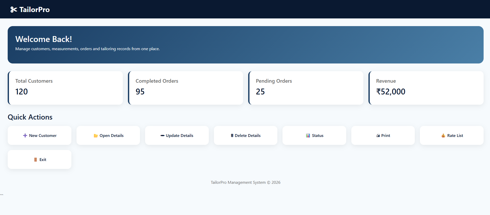
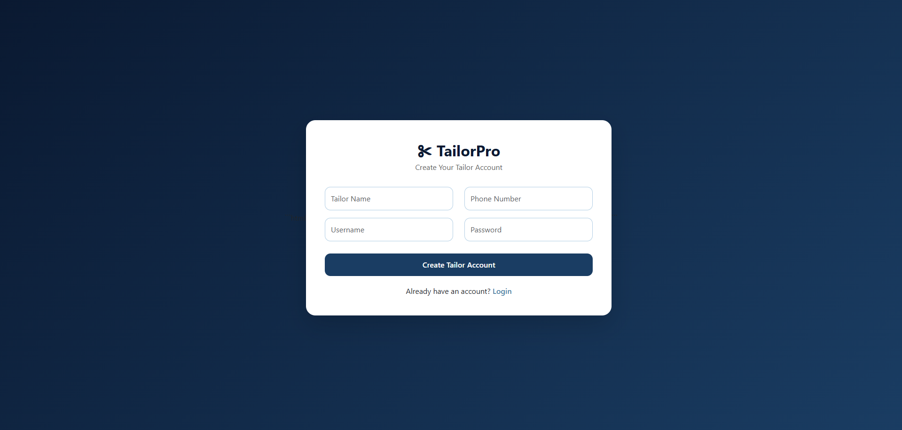
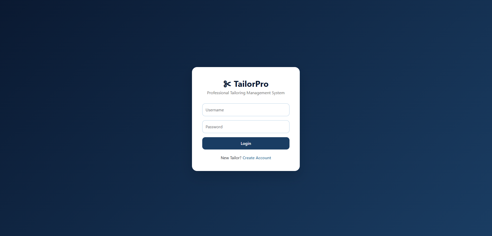
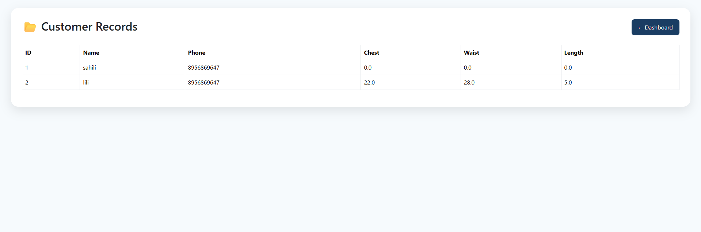

# TMS
Tailor Shop Management System is a web application developed in java with spring boot which allows you to keep track of customer’s measurements, orders and as well as print receipts for them. It helps to manage all orders/sales, customers, income, expenses, measurements, so business can keep things organized.

# ScreenShots
Dashboard

Signup

Login

Customer Records

